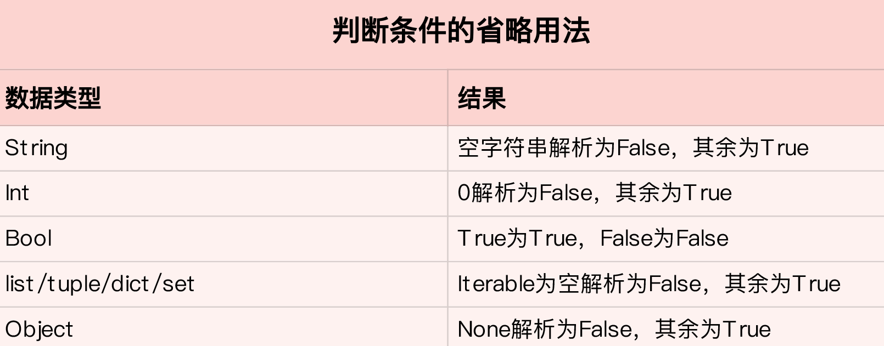

## python 基本数据类型

### 逻辑判断类型



- 

### 数值 

- 整数、浮点、复数

- 基本操作：

- - ```
    初始化:
    _a = 1
    _a = 1.1
    
    基本运算：+、-、*、/
    位运算：|、&、>>、<<、~、^
    
    常用数值操作库：math
    ```

### 布尔 bool

- 由 True 或 False 组成的值。

- 基本操作：

- - ```
    初始化:
    _a = True
    _a = False
    
    布尔运算：and、or、not
    ```

- 

### 空类型 None

- 空类型。在 python 中是数据类型的抽象化。

- 基本操作：

- - ```
    初始化:
    _a = None
    ```


### 列表 list

- 列表本质是一个动态递增的数组。可以随意的添加、删除元素。长度大小不固定。使用索引访问元素

- 基本操作：

- - ```
    初始化:
    arr = []
    arr = list()
    arr = [1,2,3]
    
    常用函数：
    ■ list.append(obj) 添加元素
    ■ list.extend(seq) 在列表末尾一次性追加另一个序列中的多个值（用新列表扩展原来的列表）
    ■ list.index(obj) 从列表中找出某个值第一个匹配项的索引位置
    ■ list.insert(index, obj) 将对象插入列表
    ■ list.pop([index=-1]) 移除列表中的一个元素（默认最后一个元素），并且返回该元素的值
    ■ list.remove(obj) 移除列表中某个值的第一个匹配项, 无返回值
    ■ list.reverse() 原地反向列表中元素
    ■ list.sort(cmp=None, key=None, reverse=False) 对原列表进行排序
    ```


### 元祖 tuple

- 元祖本质也是一个数组。但是大小固定、无法添加和删除元素。python 针对元祖进行了优化。支持索引访问元素。

- 基本操作：

- - ```
    初始化:
    arr = (1,2,3)
    
    常用函数：
    ■ tuple.count(obj) 统计某个元素在元组中出现的次数
    ■ tuple.index(obj) 表示返回元组中 item 第一次出现的索引。
    ```


### 字典 dict

- 字典本质是由哈希表、key、value 组成的无序集合。通过 key 值访问元素。

- 基本操作：

- - ```
    初始化:
    _map = {}
    _map = dict()
    _map = {'name':'zhang'}
    
    常用函数：
    ■ dict.pop(key,default)  删除字典给定键 key 所对应的值，返回值为被删除的值。key值必须给出。 否则，返回default值。
    ■ dict.has_key(key) 如果键在字典dict里返回true，否则返回false
    ■ dict.keys() 以列表返回一个字典所有的键
    ■ dict.values() 以列表返回字典中的所有值
    ```


### 集合 set

- 集合本质是由一张哈希表组成的无序数据集合。对于重复的元素，只保存一次，可用在对序列除重。不支持索引操作和key访问，可以遍历输出所有元素。

- 基本操作：

- - ```
    初始化:
    _map = {1,2,3}
    _map = set()
    
    常用函数：
    ■ set.add(item) 增加元素
    ■ set.remove(item) 删除元素
    ■ set.pop() 删除集合中最后一个元素，可是集合本身是无序的，无法知道会删除哪个元素，小心使用。
    ■ sorted(set) 排序
    ```

### 字符串 str

- 由一个或多个字符组成。python中字符串是不可变的。

- 基本操作：

- - ```
    初始化:
    _string = "zhang"
    _string = 'zhang'
    
    常用函数：
    ■ str.split(str="") 以 str 为分隔符切片 string
    ■ str.format(item) 格式化字符串
    ■ str.strip() 去除字符串中前后空格符。
    ```


### 上下文管理器

- 上下文管理对象由  __ enter __ 和 __ exit __ 实现。配合 with 使用


### 二进制序列类型 byte

- 操作二进制数据类型的是 bytes 和 bytesarray。表示 bytes 字面值的语法与字符串字面值的大致相同，只是添加了一个 `b` 前缀。

- 基本操作：

- - ```
    初始化:
    _b = b"abc"
    ```

### 

