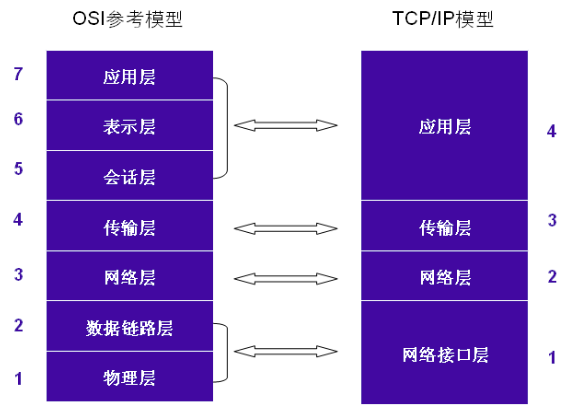
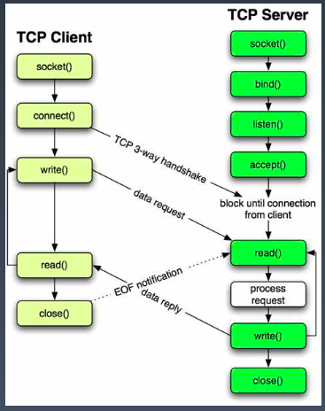
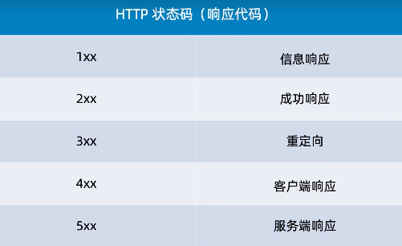

**1. 网络通信模型和TCP/IP 协议簇**

**1.1 OSI 参考模型与TCP/IP 模型**

- OSI 各层的基本作用

- - 应用层：为应用程序提供网络服务
  - 表示层：数据格式化、加密、解密
  - 会话层：建立维护会话和管理链接
  - 传输层：建立和维护端到端链接
  - 网络层：IP地址和路由
  - 数据链路层：控制网络层和物理层之间通信
  - 物理层：比特流传输

**1.2 socket 编程**

- socket 的工作原理

  

- socket API 

- - socket.**socket**(*family=AF_INET*, *type=SOCK_STREAM*, *proto=0*, *fileno=None*)

  - - family 地址簇类型常用的两种：[*AF_INET*](https://docs.python.org/zh-cn/3.7/library/socket.html#socket.AF_INET) *(IPv4)、*[*AF_INET6*](https://docs.python.org/zh-cn/3.7/library/socket.html#socket.AF_INET6) *(IPV6)*
    - type 套接字类型： [*SOCK_STREAM*](https://docs.python.org/zh-cn/3.7/library/socket.html#socket.SOCK_STREAM) *(TCP)、*[*SOCK_DGRAM*](https://docs.python.org/zh-cn/3.7/library/socket.html#socket.SOCK_DGRAM)*(UDP)* 

  - bind/connect

  - - **bind**(*address*)
    - **connect**(*address*)

  - **listen**([*backlog*])

  - - 启动一个服务器用于接受连接。如果指定 backlog 则它最低为 0（小于 0 会被置为 0），它指定系统允许暂未 accept 的连接数，超过后将拒绝新连接。未指定则自动设为合理的默认值。

  - accept()

  - - 接受一个连接。返回值是一个 (conn, address) 对，其中 conn 是一个新的套接字对象，用于在此连接上收发数据，address 是连接另一端的套接字所绑定的地址。

  - **recv**(*bufsize*[, *flags*])

  - - 从套接字接收数据。返回值是一个字节对象，表示接收到的数据。bufsize 指定一次接收的最大数据量。

  - **send**(*bytes*[, *flags*])

  - - 发送数据给套接字。本套接字必须已连接到远程套接字。

  - **close**(*fd*)

  - - 关闭一个套接字文件描述符。它类似于 [os.close()](https://docs.python.org/zh-cn/3.7/library/os.html#os.close)，但专用于套接字。在某些平台上（特别是在 Windows 上），[os.close()](https://docs.python.org/zh-cn/3.7/library/os.html#os.close) 对套接字文件描述符无效。

**1.3 网页爬取**

- http 状态码

- 

- 爬虫可能需要使用的 header 信息。

- - request url

  - request metod

  - status code

  - user-agent: 模拟使用的浏览器对象。可使用 [fake_useragent](https://pypi.org/project/fake-useragent/) 模块实现。

  - - from fake_useragent import UserAgent
    - ua = UserAgent(verify_ssl=False)

  - cookie

  - referer

- [lxml 模块](https://lxml.de/tutorial.html#the-element-class) 构建和解析html元素 。

- - 例如。解析 html 元素

  - - from lxml import etree
    - selector = etree.HTML(response.text)
    - film_name = selector.xpath('//div[@class="hd"]/a/span[1]/text()')

  - [xpath 语法规则](https://zhuanlan.zhihu.com/p/29436838)。

  - - /从当前节点选取直接子节点
    - //从当前节点选取子孙节点
    - @选取属性
    - ..选取当前节点的父节点
    - .选取当前节点
    - text() 选取文本内容